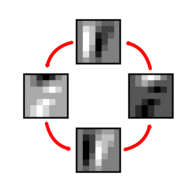

# G-CNN Experiments

Code for reproducing the experiments reported in:
[T.S. Cohen](http://ta.co.nl), [M. Welling](https://staff.fnwi.uva.nl/m.welling/), [Group Equivariant Convolutional Networks.](https://tacocohen.files.wordpress.com/2016/06/gcnn.pdf) Proceedings of the International Conference on Machine Learning (ICML), 2016



A rotating feature map on the rotation-translation group p4. See section 4 of the paper.

## Results

### Comparison to other methods

There are two common regimes for comparing classifiers on CIFAR10:

- No data augmentation (CIFAR10)
- Modest augmentation with small translations and horizontal flips (CIFAR10+)

| Network                     | CIFAR10  | CIFAR10+ |
|-----------------------------|----------|----------|
| Maxout [8]                  | 11.68    | 9.38     |
| DropConnect [9]             |          | 9.32     |
| NiN [10]                    | 10.41    | 8.81     |
| DSN [13]                    | 9.69     | 7.97     |
| All-CNN-C [11]              | 9.07     | 7.25     |
| Highway nets [15]           |          | 7.6      |
| ELU [12]                    |          | 6.55     |
| Generalized Pooling [14]    | 7.62     | 6.05     |
| ResNet1001 [18]             |          | 4.62     |
| ResNet101 [17]              |          | 6.43     |
| Wide ResNet 28 [16]         |          | **4.17** |
| p4m-Resnet26 (ours)         | **5.74** | 4.19     |


### Comparison of G-CNNs

We compare the following group convolutions:

- Z<sup>2</sup> is the 2D translation group (used in a standard CNN)
- p4 is the group of translations and rotations by multiples of 90 degrees
- p4m is the group of translations, reflections and rotations by multiples of 90 degrees

We compare the following architectures:

- All-CNN-C is described in [11].
- ResNet44 is a 44 layer residual network [18] with 32, 64, 128 filters per stage. For the p4m version, we use 11, 23, 45 filters per stage.
- ResNet26 is a 26 layer residual network [18] with 71, 142, 284 filters per stage. For the p4m version, we use 25, 50, 100 filters per stage.

| Network    | G             | CIFAR10  | CIFAR10+ | Param.    |
|------------|---------------|----------|----------|-----------|
| All-CNN-C  | Z<sup>2</sup> |   9.44   |   8.86   |   1.37M   |
|            | p4            |   8.84   |   7.67   |   1.37M   |
|            | p4m           |   7.59   |   7.04   |   1.22M   |
|  ResNet44  | Z<sup>2</sup> |   9.45   |   5.61   |   2.64M   |
|            | p4m           |   6.46   |   4.94   |   2.62M   |
|  ResNet26  | Z<sup>2</sup> |   8.95   |   5.27   |   7.24M   |
|            | p4m           |   5.74   |   4.19   |   7.17M   |

We see a very consistent behaviour: 

- p4-CNNs outperform Z<sup>2</sup>-CNNs
- p4m-CNNs outperform p4-CNNs
- Data augmentation is beneficial for all CNNs.


## Installation
Install scientific python stack and progressbar
```
$ pip install ipython numpy scipy matplotlib progressbar2 skimage
```

Install [chainer](http://chainer.org/) with CUDNN and HDF5: [installation instructions](https://chainer.readthedocs.io/en/stable/install.html)

Install [GrouPy](https://github.com/tscohen/GrouPy)

## Download data

### CIFAR10

```
$ cd [datadir]
$ wget http://www.cs.toronto.edu/~kriz/cifar-10-python.tar.gz
$ tar zxvf cifar-10-python.tar.gz
$ rm -rf cifar-10-python.tar.gz
```

## Train a G-CNN

The first time you run an experiment, the code will preprocess the dataset and leave a preprocessed copy in \[datadir\].

```
$ cd gconv_experiments
$ ipython CIFAR10/train.py -- --datadir=[datadir] --resultdir=[resultdir] --modelfn=CIFAR10/models/P4AllCNNC.py
```
For other options, see train.py.


## References

### Related work

1. Kivinen, Jyri J. and Williams, Christopher K I. Transformation equivariant Boltzmann machines. In 21st International Conference on Artificial Neural Networks, 2011.
2. Sifre, Laurent and Mallat, Stephane. Rotation, Scaling and Deformation Invariant Scattering for Texture Discrimination. IEEE conference on Computer Vision and Pattern Recognition (CVPR), 2013.
3. Gens, R. and Domingos, P. Deep Symmetry Networks. In Advances in Neural Information Processing Systems (NIPS), 2014.
4. Jaderberg, M., Simonyan, K., Zisserman, A., and Kavukcuoglu, K. Spatial Transformer Networks. In Advances in Neural Information Processing Systems 28 (NIPS 2015), 2015.
5. Oyallon, E. and Mallat, S. Deep Roto-Translation Scattering for Object Classification. In IEEE Conference on Computer Vision and Pattern Recognition (CVPR), 2015.
6. Zhang, C., Voinea, S., Evangelopoulos, G., Rosasco, L., and Poggio, T. Discriminative template learning in group-convolutional networks for invariant speech representations. InterSpeech, 2015.
7. Dieleman, S., De Fauw, J., and Kavukcuoglu, K. Exploiting Cyclic Symmetry in Convolutional Neural Networks. In International Conference on Machine Learning (ICML), 2016.


### Papers reporting results on CIFAR10

8. Goodfellow, I. J., Warde-Farley, D., Mirza, M., Courville, A., and Bengio, Y. Maxout Networks. In Proceedings of the 30th International Conference on Machine Learning (ICML), pp. 1319–1327, 2013.
9. Wan, L., Zeiler, M., Zhang, S., LeCun, Y., and Fergus, R. Regularization of neural networks using dropconnect. International Conference on Machine Learning (ICML), 2013.
10. Lin, M., Chen, Q., and Yan, S. Network In Network. International Conference on Learning Representations (ICLR), 2014.
11. Springenberg, J.T., Dosovitskiy, A., Brox, T., and Riedmiller, M. Striving for Simplicity: The All Convolutional Net. Proceedings of the International Conference on Learning Representations (ICLR), 2015.
12. Clevert, D., Unterthiner, T., and Hochreiter, S. Fast and Accurate Deep Network Learning by Exponential Linear Units (ELUs). arXiv:1511.07289v3, 2015.
13. Lee, C., Xie, S., Gallagher, P.W., Zhang, Z., and Tu, Z. Deeply-Supervised Nets. In Proceedings of the Eighteenth International Conference on Artificial Intelligence and Statistics (AISTATS), 2015.
14. Lee, C., Gallagher, P. W., and Tu, Z. Generalizing Pooling Functions in Convolutional Neural Networks: Mixed, Gated, and Tree. ArXiv:1509.08985, 2015.
15. Srivastava, Rupesh Kumar, Greff, Klaus, and Schmidhuber, Jurgen. Training Very Deep Networks. Advances in Neural Information Processing Systems (NIPS), 2015.
16. Zagoruyko, S. and Komodakis, N. Wide Residual Networks. arXiv:1605.07146, 2016.
17. He, K., Zhang, X., Ren, S., and Sun, J. Deep Residual Learning for Image Recognition. arXiv:1512.03385, 2015.
18. He, Kaiming, Zhang, Xiangyu, Ren, Shaoqing, and Sun, Jian. Identity Mappings in Deep Residual Networks. arXiv:1603.05027, 2016.